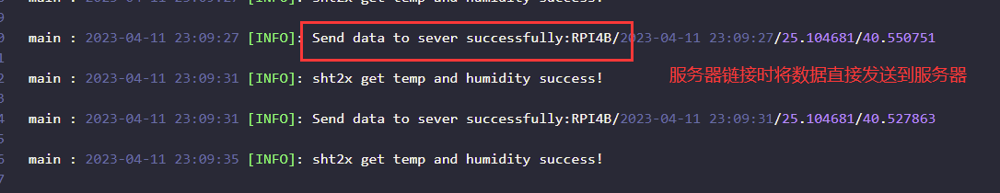
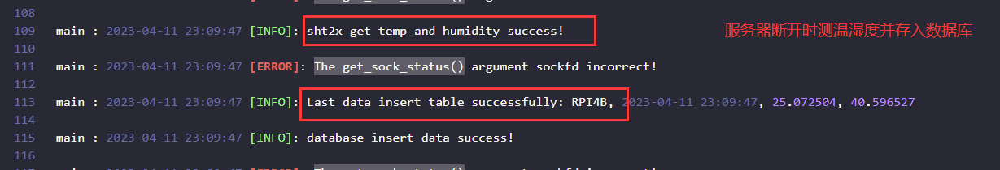
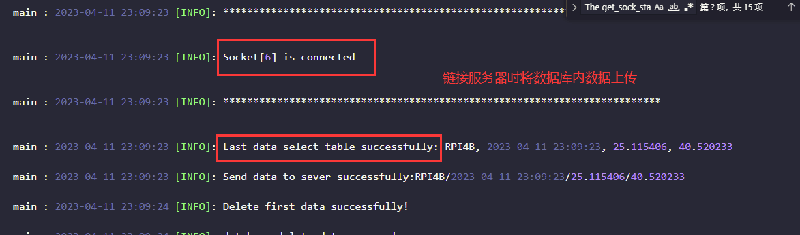
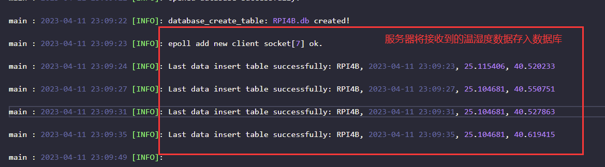
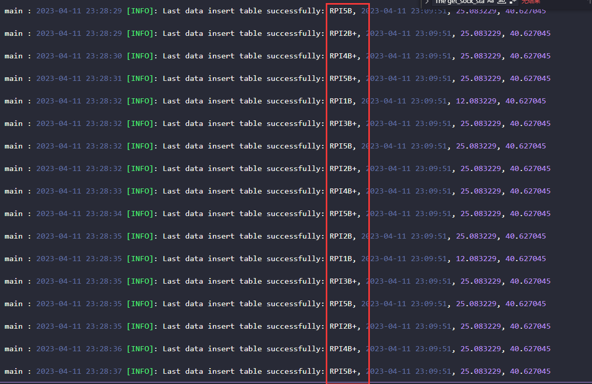
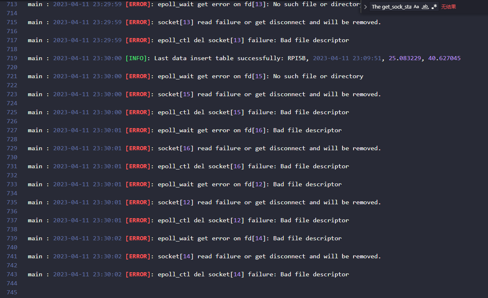

# 树莓派温湿度上报

​	这是一个树莓派和SHT20温湿度传感器制作的简单温湿度上报项目

> 使用设备：
>
> + 树莓派4B
> + SHT20 i2c控制温湿度传感器
>

## client 客户端程序

​	这是使用i2c协议与SHT20温湿度传感器通信，定时进行温湿度采集并上报的客户端，主要功能有：

+ 与服务端链接时，定时温湿度采集并上报服务端
+ 若与服务端是断线状态，则存入本地sqlite数据库
+ 当与服务端恢复链接状态，将本地sqlite数据库数据上报服务端
+ 日志系统记录工作情况

### 测试记录

定时温湿度采集并上报服务端

断线状态存入本地sqlite数据库

恢复链接状态上传sqlite数据

## server 服务端程序

​	这是接收客户端温湿度上报的服务端程序，使用epoll多路复用，可链接多个客户端，主要功能为

+ 可链接多个客户端
+ 接收各个客户端上报的数据并存入sqlite数据库
+ 日志系统记录上报信息

### 测试记录

接收数据存入sqlite

模拟多个客户端链接

模拟的多个客户端断开链接

